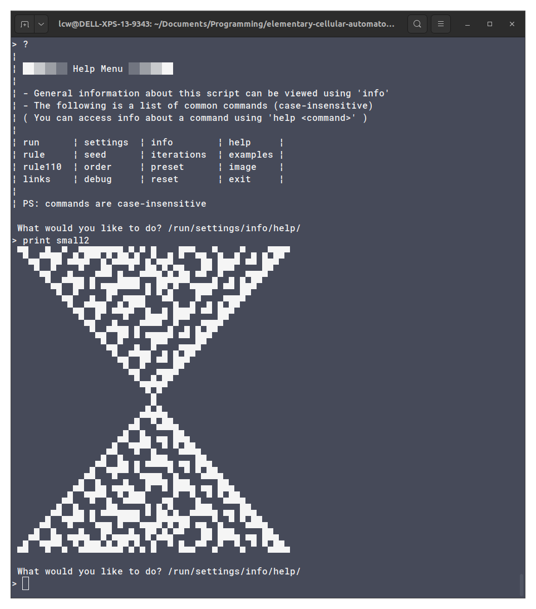
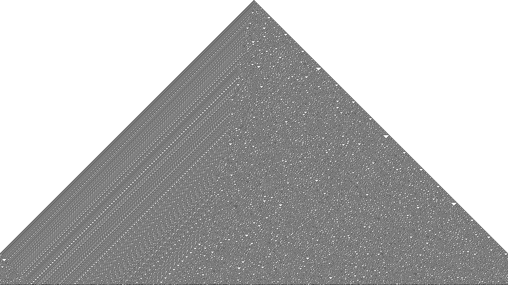
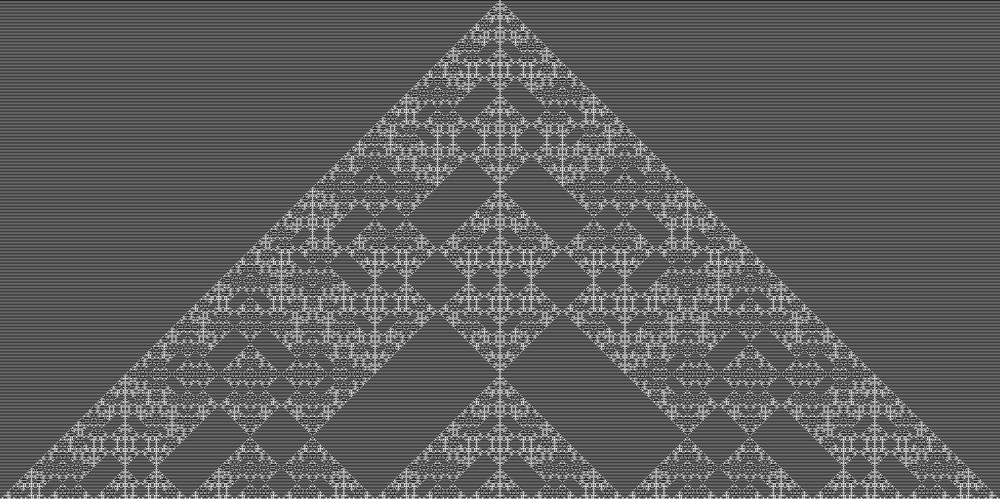
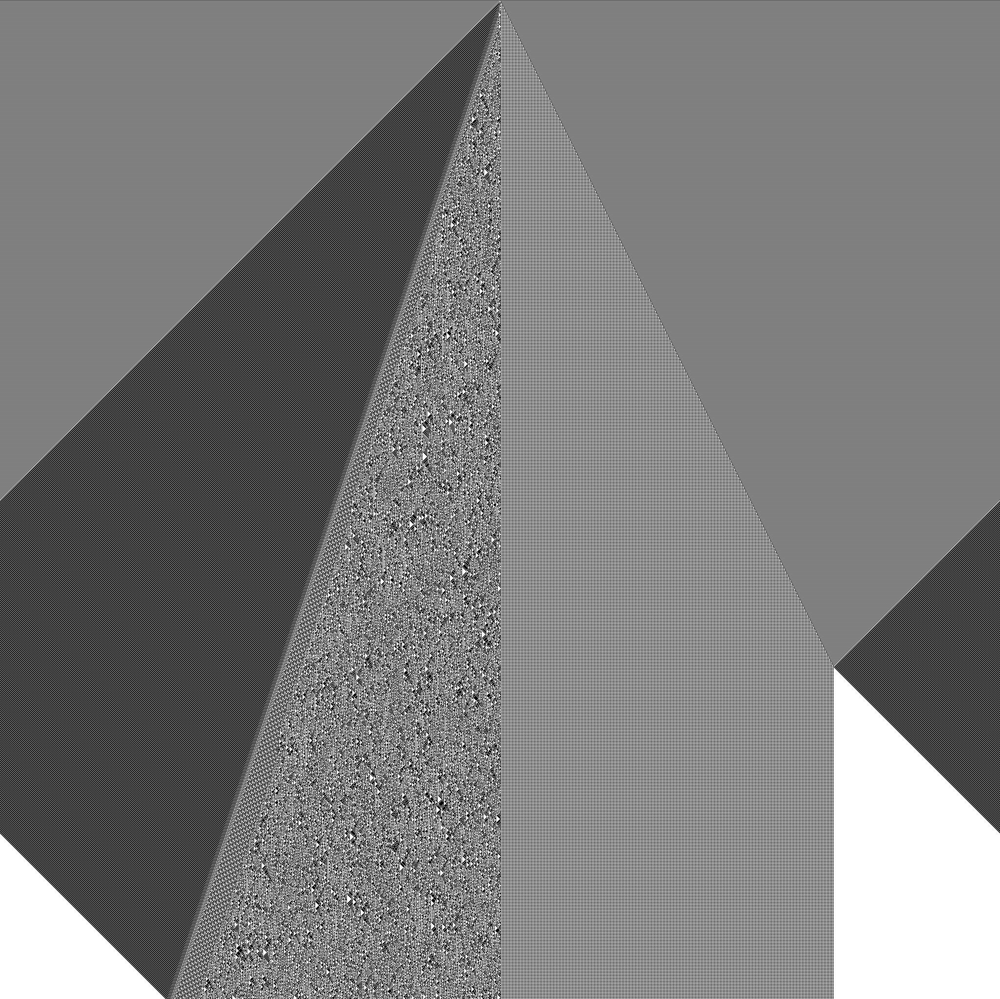
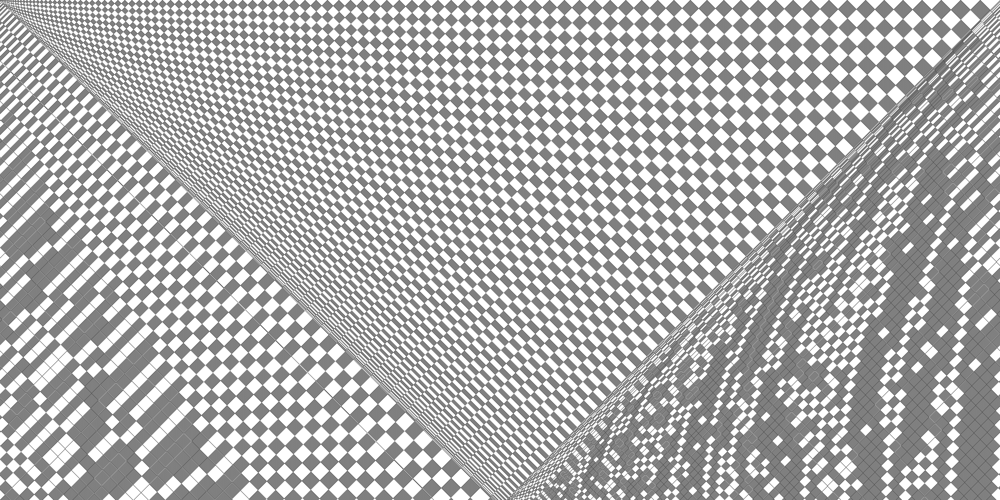
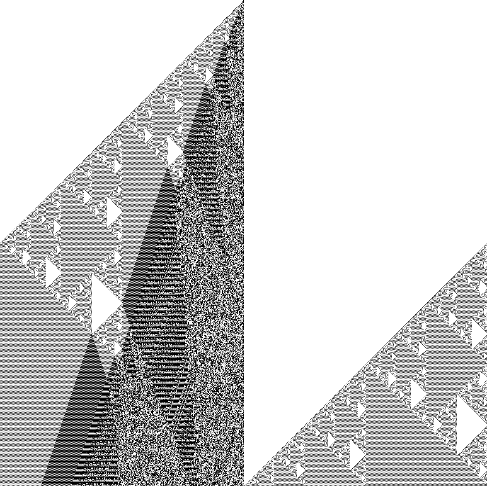

# elementary-cellular-automaton

*A script to experiment with and visualize elementary cellular automata (command-line or PNG).*

# What is this?
This repository stores my first bigger Python project I had worked on (2018, not on GitHub):
The monolithic [*elementary cellular automaton* script](./ECAutomaton.py) proudly boasts over 1000 lines of completely unreadable spaghetti code from when I was learning Python.

I even started using Overleaf to write a (not very useful nor comprehensive) ['user manual.'](./ECA_User_Manual.pdf)

# How could I use it?
Run `ECAutomaton.py` and directly use the command-line to navigate scripted menus and draw ASCII (Unicode) art, etc.

*(Note to self: use `cmd` to display all commands (unlike `help`))*

# What can it do?

Customize and generate visualizations in console and PNG.

List of practical 'commands'.

- `info` Information about the script itself!
- `links` External resources on the topic!
- `examples` Built-in examples.
- `image` Save & show last pattern as image.
- `print` / `print small` / `print small2` Print pattern to console.
- `preset cells` For how Unicode art is printed.

- `randrule` / `rr` Randomize rule and print result.
- `randseed` / `rs` Randomize seed and print result.
- `randseed+` / `rs+` *Advancedly* randomize seed and print result.

- `rule` Change generation rule/behaviour.
- `seed` Change seed generation.
- `edges` Change behaviour at cell boundaries (wrap or fixed).
- `history` Change imaginary -1st generation (copy of 0th, fixed or custom.
- `iterations` How many rows are generated.
- `merge` Comparing two different generated patterns.
- `order` Toggles the *order* (first, second).
- `shift` linear Shift of iterations for display purposes.
- `rule110` Enter 'gliders' (Cook notation).
- `rule110 ether` Toggle display of gliders against 'background.'
- `funfact` 12 fun facts.

# Gallery

## Screenshot

## Examples

### Built-ins

These are also built-into the script.

Show all.

> Example 1 Sierpinski Fractal (rule 60)
.png)

> Example 2 Pascal's triangle modulo 2 (rule 90)
.png)

> Example 3 Particle collision simulation (rule 184)
.png)

> Example 4 Triangular fractal pattern (rule 150)
.png)

> Example 5 Chaos even from simple conditions (rule 30)
.png)

> Example 6 Rule with growth behaviour of sqrt(x) (rule 106)
.png)

> Example 7 Rule 110 example
.png)

> Example 8 Example of a 2nd-order, reversible seed (rule 214R)
.png)

> Example 9 Interesting looking rule with individual compartments (rule 73R)
.png)

> Example 10 Carpet-pattern-rule (rule 150R)
.png)

> Example 11 Chaotic rule distantly resembling organic tissue (rule 105R)
.png)

> Example 12 Rule that turns out to be example 4 but rotated 90 degrees (rule 60R)
.png)

> Example 13 'Inverted'-rule-version of example 9 (rule 146)
.png)

> Example 14 An interesting 2nd-order rule (rule 210R)
.png)

> Example 15 Another interesting 2nd-order rule (rule 202R)
.png)

> Example 16 And another one (rule 218R)
.png)

> Example 17 Pattern with horizontal axis of symmetry (rule 90R)
.png)

### Big

1080 generations of rule 30.

1024 generations of rule 150 order 2.

2048 generations of rule 150 order 2.

2525 generations of rule 218 order 2.

4096 generations of rule 226 order 2.

### Colored

1000 generations of rule 110, with/without ether highlight.

512 generations of rule 90 order 2, flood-fill color.

